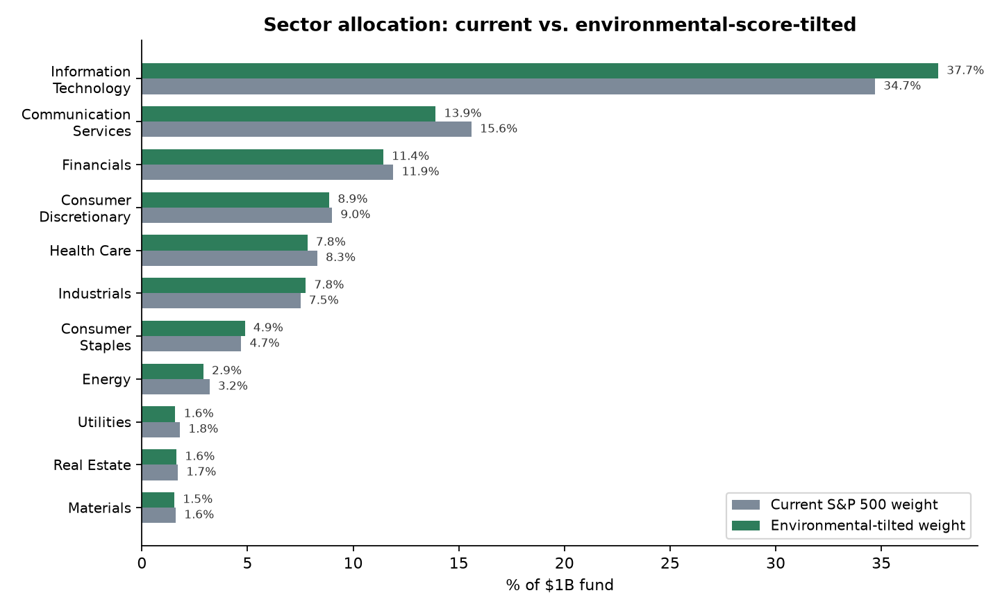

# Bonus question

> Tomorrow, the world commits to reaching net-zero emissions as fast as
> possible. You manage a $1 billion investment fund. How do you allocate
> your portfolio under this new scenario, and why?

## The key framing decision

This isn't a gradual multi-decade rebalancing problem. Most real
institutional net-zero frameworks (e.g. the IIGCC's Net Zero Investment
Framework) are built around 10-year engagement horizons, on the
assumption that the transition happens slowly enough for portfolios to
adjust alongside it. **"Tomorrow the world commits" is a shock
scenario** — closer to how markets reprice around a surprise policy
announcement than a gradual trend. That changes the strategy: the goal
isn't to slowly tilt toward companies you expect to improve over a
decade, it's to already be positioned for a repricing that happens fast,
and to get ahead of the companies most exposed to it.

## Why the risk is large and asymmetric

- The IEA estimates private oil & gas companies are valued at roughly
  **$6 trillion** under current policy settings — but that value is
  **~25% lower** if every existing national climate pledge is actually
  met, and **~60% lower** on a pathway consistent with 1.5°C.
- Research from Exeter and Lancaster universities (2024) found that a
  complete halt to fossil fuel investment in 2020 would have put **$117
  trillion** of global capital at risk of stranding — delaying that halt
  to 2030 raises it to **$557 trillion** (about 37% of all global
  capital today). The longer fossil investment continues before a
  net-zero shock, the larger the eventual repricing — which is exactly
  this scenario's premise: the delay just ended, all at once.

This is asymmetric: on the upside, a well-positioned company doesn't
suddenly become dramatically more valuable overnight; on the downside, a
poorly-positioned one can lose a large fraction of its value very
quickly. That argues for a risk-management-first allocation, not a
pure return-chasing one.

## The allocation: tilt the core, overweight verified leaders, underweight credibility risk

Real institutional practice (IIGCC's NZIF explicitly favors engagement
and tilting over blanket divestment, since exclusion loses information
and concentrates risk elsewhere) shaped the structure. The actual
tilting signal is our own Level/Velocity/Integrity data from this
project, not a generic ESG label.

### 1. Core holdings (~85%) — cap-weighted, tilted by sector environmental score

Every company's `environmental_composite_score` (from
`data/environmental_scores.csv`) is averaged by GICS sector and compared
to the sector's current S&P 500 market-cap weight. Sectors scoring above
the cap-weighted mean get tilted up; sectors scoring below get tilted
down — moderately (a 1.5× sensitivity factor), not to zero, since Energy
and Utilities are already a small share of the index and some
individual companies within a "dirty" sector are real transition
leaders (see below) that a blanket sector cut would wrongly punish.

| Sector | Current weight | Tilted weight | Dollar shift (of $1B) |
|---|---|---|---|
| Information Technology (score 65.0) | 34.7% | 37.7% | **+$30M** |
| Communication Services (score 52.0) | 15.6% | 13.9% | **−$17M** |
| Financials (56.6) | 11.9% | 11.4% | −$5M |
| Consumer Discretionary (58.3) | 9.0% | 8.9% | −$1M |
| Health Care (55.5) | 8.3% | 7.8% | −$5M |
| Industrials (61.5) | 7.5% | 7.8% | +$3M |
| Consumer Staples (61.7) | 4.7% | 4.9% | +$2M |
| Energy (53.2) | 3.2% | 2.9% | −$3M |
| Utilities (51.2) | 1.8% | 1.6% | −$2M |
| Real Estate (56.7) | 1.7% | 1.6% | −$1M |
| Materials (56.5) | 1.6% | 1.5% | −$1M |

### 2. Transition Leaders overweight sleeve (~10%, ~$100M)

Overweight companies our pipeline verifies are *actually* cutting
emissions at the required pace, not just pledging to. From
`environmental_scores.csv`, 15 companies have `velocity_basis =
measured_trend` (a real multi-year emissions comparison, not a target
promise) **and** a velocity score ≥80 (at or near SBTi's required
reduction pace):

**UNH, LHX, AFL, AIZ, HUBB, AMP, CDNS, GWW, SLB, INTU, MNST, JCI, AES,
DD, GLW**

Note `SLB` (Schlumberger, oilfield services) is on this list —
deliberate proof that the tilt is evidence-based per company, not a
sector stereotype. A real Energy-sector company can still be a genuine
transition leader.

### 3. Credibility-risk underweight (~5%, trimmed from wherever these names already sit)

The sharpest signal for a shock scenario is a company that **set a
validated science-based target and then withdrew it**
(`sbti_near_term_status = Commitment removed`). 37 companies carry this
flag in our data, including several mega-caps: **Tesla, Amazon, Meta,
Johnson & Johnson, Walmart**, among others. In a sudden universal
net-zero mandate, these are exactly the companies most exposed to
regulatory scrutiny, activist pressure, and capital flight — they've
already demonstrated they can walk back a public climate commitment,
which is a materially worse signal in a shock scenario than never having
made one at all. Underweight these regardless of sector or size.

## Why using our own data matters here

Every number above traces back to a `*_is_estimated` / `*_basis` flag in
this project's own pipeline. A real fund would size positions by
confidence, not just score: a company scoring well because of
`measured_trend` Velocity (real, multi-year data) deserves more
conviction than one scoring the same from `target_ambition` (a promise,
not a measurement). The same real-vs-estimated discipline this entire
project is built on — see `docs/SCORE_METHODOLOGY.md` — applies directly
to how confidently you'd actually size each position, not just how you
rank companies.

## Honest limitations

- This tilt is built from **backward-looking** Level/Integrity data and
  **forward-looking but unverified** Velocity/target data for over half
  the index. A genuinely fast policy shock could reprice companies whose
  transition plans aren't real faster than this kind of data can catch.
- Concentrating further into Information Technology (already 34.7% of
  the index, now higher under this tilt) is a real single-sector
  concentration risk independent of climate considerations, and worth
  capping in practice even though the environmental case supports the
  tilt.

## Sources

- [IEA — The Oil and Gas Industry in Net Zero Transitions](https://www.iea.org/reports/the-oil-and-gas-industry-in-net-zero-transitions/executive-summary)
- [Stranded fossil fuel assets: up to $557 trillion at risk by 2030](https://www.asiafinancial.com/continued-fossil-fuel-investments-put-557-trillion-at-risk)
- [IIGCC Net Zero Investment Framework](https://www.iigcc.org/net-zero-investment-framework)
