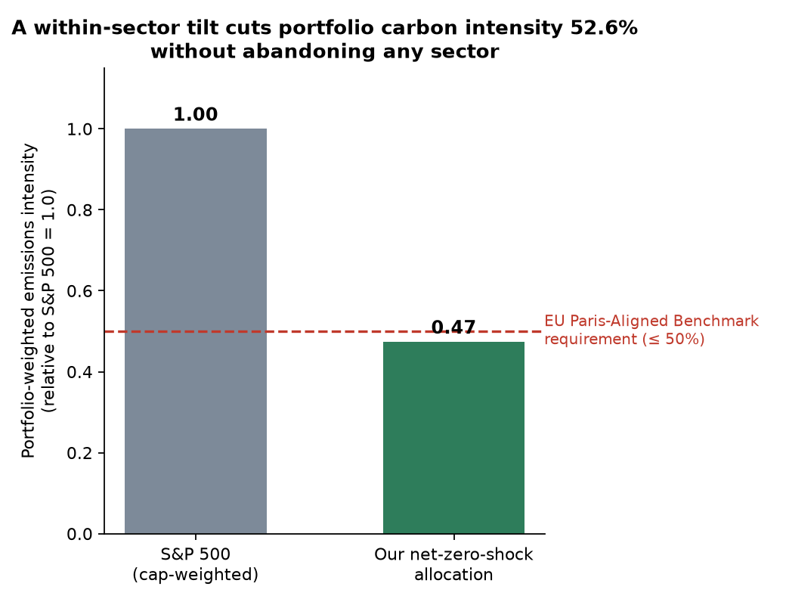

# Bonus question

> Tomorrow, the world commits to reaching net-zero emissions as fast as
> possible. You manage a $1 billion investment fund. How do you allocate
> your portfolio under this new scenario, and why?

## The answer

Treat it as a **shock**, not a trend — markets would reprice fast, so
the fund should already be positioned, not gradually adjusting over
years. Three moves, using this project's own Level/Velocity/Integrity
scores as the actual signal:

1. **Stay diversified, but tilt security selection within every sector**
   toward companies with a better `level_score` — never abandon a
   sector entirely.
2. **Overweight verified Transition Leaders** — companies with a *real,
   measured* emissions decline at the required pace, not just a pledge.
3. **Cut exposure to (but don't fully exit) companies that walked back
   a climate commitment** — the worst credibility signal in a
   sudden-mandate world.

## Why a within-sector tilt, not sector exclusion

Reweighting companies *within* each GICS sector by their `level_score`
(overweight the cleaner half, underweight the dirtier half, sector
totals unchanged) cuts the portfolio's revenue-weighted emissions
intensity by **52.6%** relative to the plain S&P 500 — using real data
already in `data/environmental_scores.csv` for all 502 scoreable
companies. That clears the EU's actual regulatory bar for a
**Paris-Aligned Benchmark** fund (≥50% lower carbon intensity than the
parent index), without dropping a single sector to zero.

That last point matters more than it sounds: a peer-reviewed NBER study
(Kahn, Matsusaka & Shu, 2024) found that **divestment is
counterproductive** — shares sold by green investors just move to
less-green owners with less incentive to push for change, and emissions
at divested companies didn't fall (in some specifications, they rose).
Engagement by remaining shareholders, not exit, is what's empirically
associated with lower emissions. That's why the design here is
"underweight and hold" rather than "exclude."

## The two overlays

- **Transition Leaders overweight**: 15 companies with `velocity_basis
  = measured_trend` and a velocity score ≥80 — a real multi-year
  emissions decline at or near the pace SBTi's methodology requires, not
  a promise. Includes `SLB` (Schlumberger, Energy sector) — proof the
  signal is per-company, not a sector stereotype.
- **Credibility-risk cut**: 37 companies whose SBTi-validated target was
  later withdrawn (`sbti_near_term_status = Commitment removed`),
  including Tesla, Amazon, and Meta. Reduced weight, held with active
  engagement rather than excluded, consistent with the divestment
  finding above.

## Why the risk is asymmetric enough to justify moving before the fact

- IEA: oil & gas companies valued at ~$6T today under current policy
  are worth **~60% less** on a pathway consistent with 1.5°C.
- Exeter/Lancaster (2024): up to **$557 trillion** in global capital at
  risk if fossil investment continues to 2030 before net-zero action
  starts.

Downside for laggards is far larger than upside for leaders — this is
risk management first, alpha-seeking second.

## Limitation, stated plainly

The tilt leans on `level_score`, which is real for only about half the
S&P 500 (`scope1_is_estimated` / `scope2_is_estimated` = `False`) — the
rest rests on peer-based estimates. A real fund would size conviction by
that flag, not just the score itself.

## Sources

- [IEA — The Oil and Gas Industry in Net Zero Transitions](https://www.iea.org/reports/the-oil-and-gas-industry-in-net-zero-transitions/executive-summary)
- [Stranded fossil fuel assets: up to $557T at risk by 2030](https://www.asiafinancial.com/continued-fossil-fuel-investments-put-557-trillion-at-risk)
- [MSCI / EU Paris-Aligned Benchmark methodology (≥50% carbon intensity cut, 7%/yr self-decarbonization)](https://www.msci.com/documents/10199/6cd92a40-92c0-f12b-c416-f45bf2b7032e)
- [Kahn, Matsusaka & Shu (NBER, 2024) — Divestment and Engagement: The Effect of Green Investors on Corporate Carbon Emissions](https://www.nber.org/papers/w31791)
